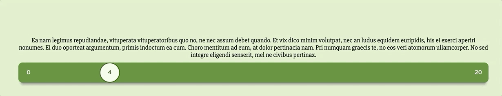
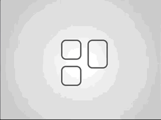
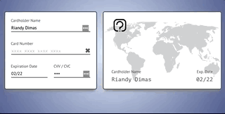

# Weeks of Element
My exploration, curiosity, and work procrastination related to front-end development. For the preview mode I will update as best I can do here, or just visit my [Collection in Codepen](https://codepen.io/collection/nMoNxQ/).

## Component

### Fluid Slider - [Codepen](https://codepen.io/riandy-dimas/full/KEwpdw)
>

This code design is purely inspired by https://github.com/Ramotion/fluid-slider and https://dribbble.com/shots/3868232-Fluid-Slider.

---

### Expanding Collection - [Codepen](https://codepen.io/riandy-dimas/full/xBwPQa)
>

This pen is inspired by https://github.com/Ramotion/expanding-collection.

---

### Circle Loading - [Codepen](https://codepen.io/riandy-dimas/full/xNxzOO)
>

Random (?) fail (?) trying to create a circular loading.

---

### Three-box Loading - [Codepen](https://codepen.io/riandy-dimas/full/VOwGEK)
>

This pen was purely inspired by https://dribbble.com/shots/5845853-Loader-XLVII.

---

### Switch-a-Page - [Codepen](https://codepen.io/riandy-dimas/full/JqYqao)
>

The design was inspired by https://dribbble.com/shots/6041286-Switcher-LI and I only changed the perspective to vertical.

---

### Credit Card Form - [Codesandbox](https://codesandbox.io/s/7y45q7p221?fontsize=14&view=preview)
>

Just a simple credit card form :) The design was purely my idea --I know the design is awful-- But I made this component for you guys :) Just a little modify needed to use it.

